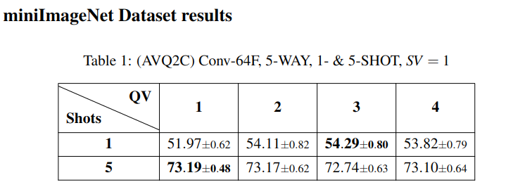
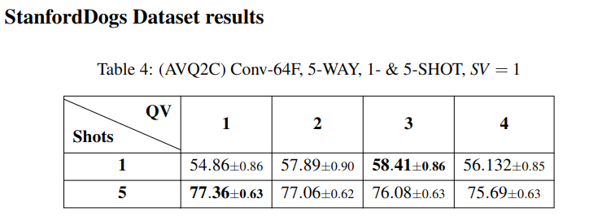
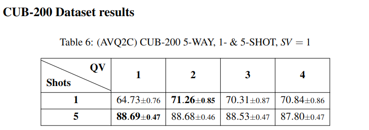
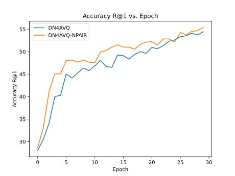
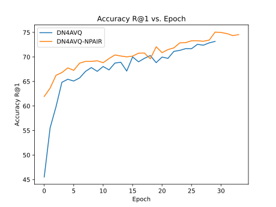
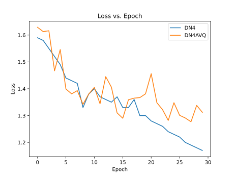
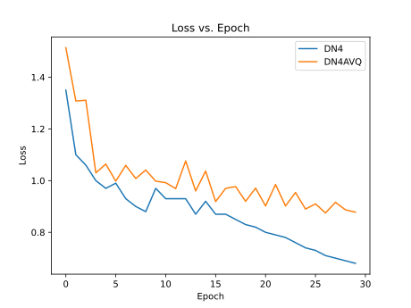

# Improving Few-shot learning for Image Classification using data augmentation and aggregation

This is a BSc Thesis that explores and seeks to improve the findings from the paper [Revisiting Local Descriptor based Image-to-Class Measure for Few-shot Learning](http://cs.nju.edu.cn/rl/people/liwb/CVPR19.pdf) by Wenbin Li, Lei Wang, Jinglin Xu, Jing Huo, Yang Gao and Jiebo Luo. In CVPR 2019.


## Prerequisites
- Unix system
- Python 3.8 - 3.10
- CUDA 10.0 - 12
- All library dependencies from `requirements.txt` (pip virtual environment recommended)


## Getting Started
### Installation

- Clone this repo:
```bash
git clone https://github.com/d33dler/avq2c.git
```

- Install `requirements.txt` dependencies with `pip`:
```bash
pip install -r requirements.txt
```
- ```cd executables/``` and  run `python execute.py --help` to see the available options.

### Datasets
- [miniImageNet](https://drive.google.com/file/d/1fUBrpv8iutYwdL4xE1rX_R9ef6tyncX9/view). 
- [StanfordDog](http://vision.stanford.edu/aditya86/ImageNetDogs/).
- [StanfordCar](https://ai.stanford.edu/~jkrause/cars/car_dataset.html). (Not tested)
- [CUB-200](http://www.vision.caltech.edu/visipedia/CUB-200.html). <br>

For training and testing on different conditions you must edit the model root config.
Refer to ```models/architectures/config_blueprints/CONFIG_DOCUMENTATION``` for the model config documentation.

**You may also re-use config samples from ```models/architectures/config_blueprints/``` to reproduce the results in the paper.** 
### Training & testing
We run the script from the _exec_ directory of the project.
```bash
cd executables
```
- Run
    ------
    `python execute.py [--jobs JOB [JOB ...]] [--jobfile JOBFILE] [--job_id JOB_ID] [--test]`

    ###  Options:
    - `jobs JOB [JOB ...]`
        Paths(s) to the model config file(s). Each file should be in YAML format and contain the configuration
        parameters required for a job.
    - `jobfile JOBFILE`
        Path to a file containing a list of job arrays. The file should be in YAML format and list configurations or
        paths to configurations for multiple jobs.

    - `job_id JOB_ID`
        An integer representing the index of the job to be launched from the job array specified in the jobfile. 
        Indexing starts at 1.

    - `test`
        Run the script in test mode. If this flag is set, the jobs will be launched in test mode.

- ### Results 



- ### Plots




